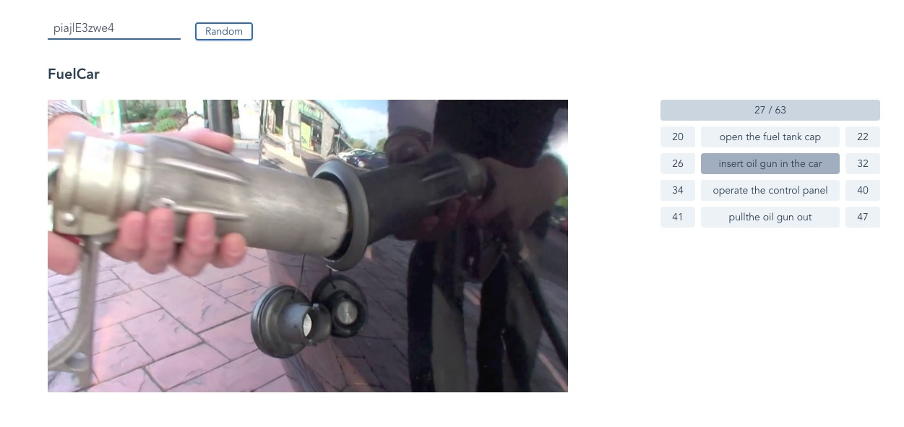

# DeepDemo

A simple demo template powered by Vue and Flask.



## Basic functions

- Vue
- Flask
  - CORS
  - sample RESTful api
- TailwindCSS
- Fontawesome
- Lodash

## Quick start

1. Install dependencies 

``` bash
# Install python packages
pip install -r requirements.txt

# Install node packages
cd client
yarn install
```

2. Launch api server first

``` bash
python core.py serve_api --port 9000
```

3. Launch ui server in another command line

``` bash
python core.py serve_ui
```

4. Visit the url of the ui server